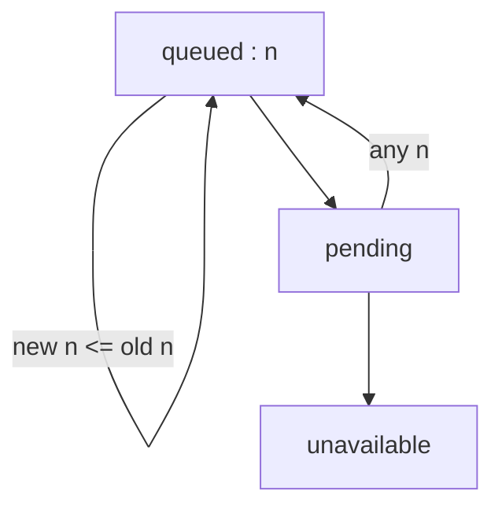
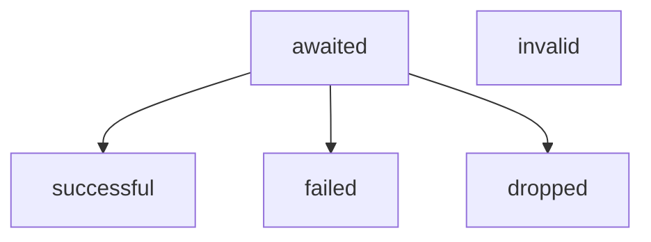
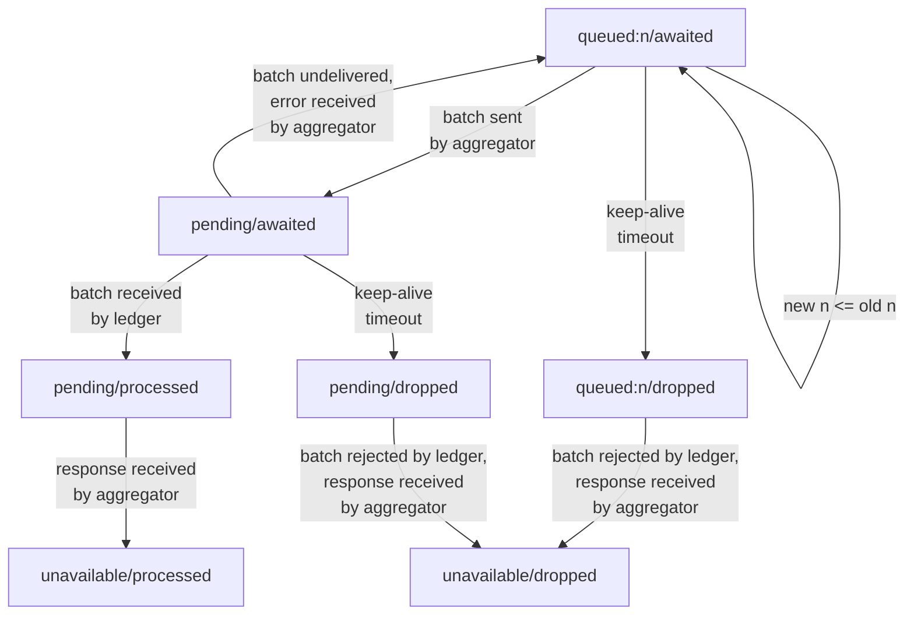
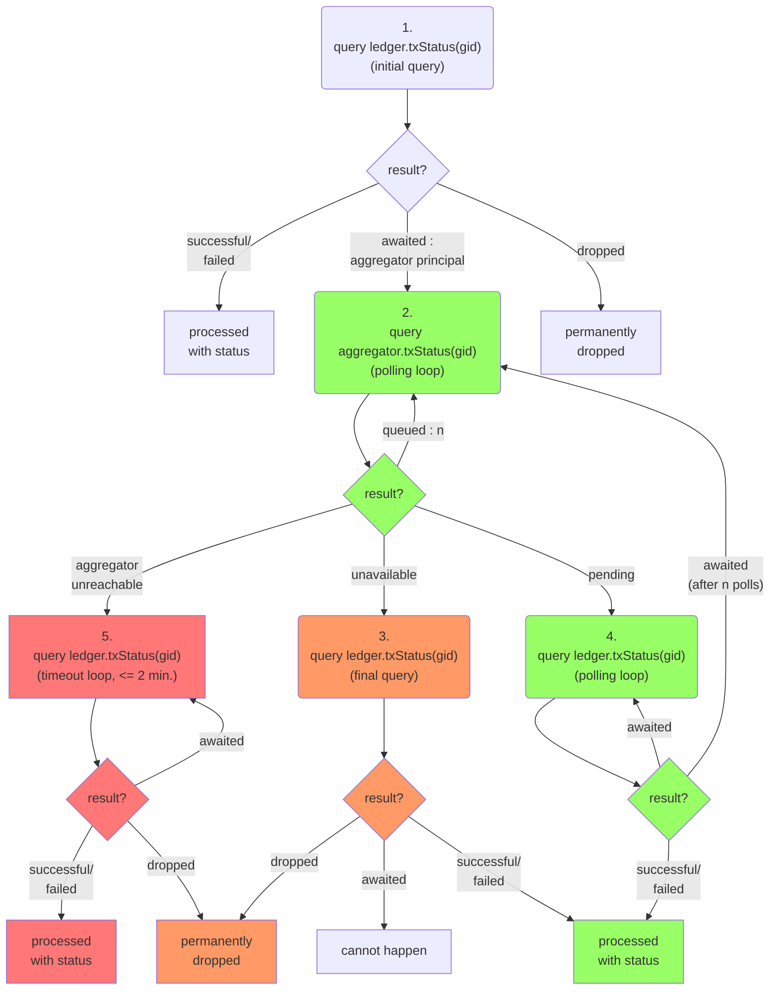

# hpl-io
The high-performance ledger

TODO:
* how does aggregator respond to txStatus after restart, before it has a new stream id?
* diagram needs transition arrow for aggregator restart
* ledger rejects if there is gap in then stream
* ledger responds with an error if a stream is closed

## Aggregator tx status state transitions

## Ledger tx status state transitions

## Aggregator/Ledger combined tx status state transitions

## Frontend status querying

If the transaction is older then the frontend would expect that the transactions has already been processed. In this case it starts with step 1.

If the transaction is fresh then it may not have been processed yet. If the frontend remembers the principal of the aggregator to which it was submitted then the frontend starts with step 2, otherwise with step 1.

Under normal circumstances the green flow happens.

If the frontend polls slowly it may miss the `pending` state. This causes it to switch over to the orange flow.

In the rare case that the aggregator is unreachable (e.g. down for upgrade, frozen, deleted) the red path happens.

