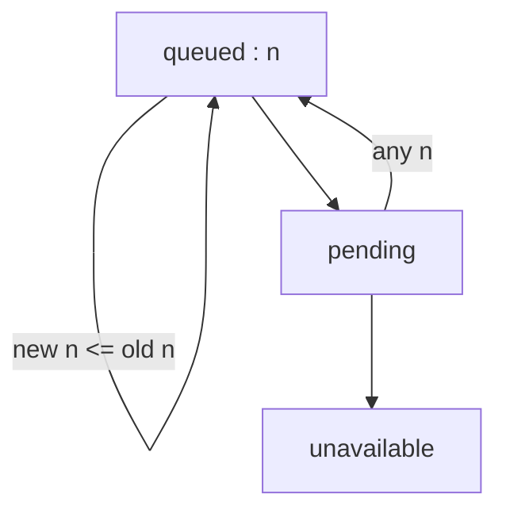
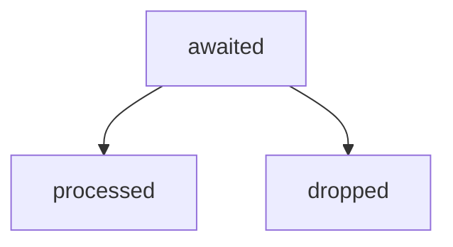
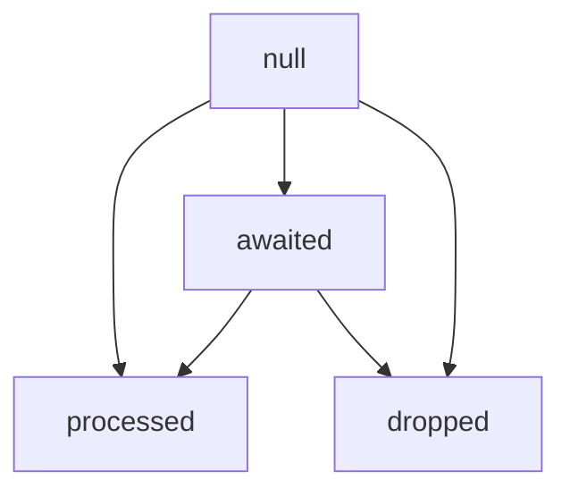
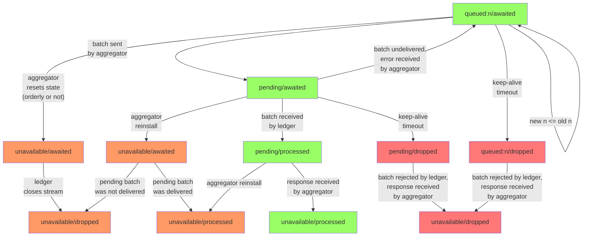
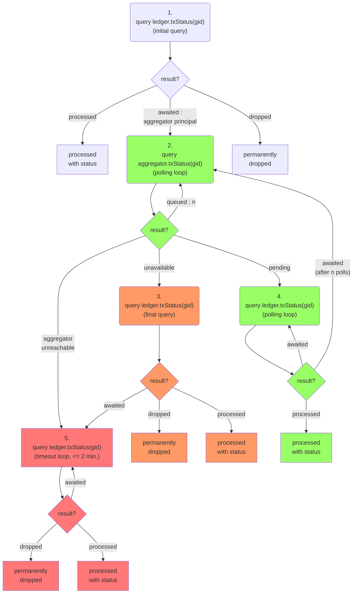

# hpl-io
The high-performance ledger

The red path happens if the aggregator has gone through an upgrade and lost its state.
The aggregator might be unreachable for the frontend (e.g. down for upgrade, frozen, deleted) 
or it might already be back up but with its former state deleted.

   Note that the status in the aggregator can go from "pending" back to
   "queued". This can happen if an inter-canister message carrying a batch
   fails.  The aggregator will automatically resend the batch, so after a
   while the status will go to "pending" a second time.

   Transactions can be permanently dropped due to the following reasons:
   * The aggregator was frozen (due to low cycle balance) and remained frozen
   for a certain time (~2 minutes) while the transaction was queued.
   * The aggregator ran out of cycles entirely (hence got uninstalled) while
   the transaction was queued.
   * The communication from the aggregator's subnet to the ledger's subnet was
   interrupted for longer than a certain time (~2 minutes).
   * The aggregator was upgraded while the transaction was queued and the
   upgrade took longer than a certain time (~2 minutes).
   * The aggregator was upgraded while the transaction was queued and
   discarded its state.

## processBatch

* Ledger rejects if there is gap in then stream (as if message was not delivered). This is done because the aggregator handles it just like if the message was not delivered, in a unified way.
* Ledger accepts the message and responds with an error if the stream is closed. This is done because the aggregator has to programmatically handle this response.

## Aggregator gid status state transitions

## Ledger gid status state transitions

For valid gids the transition diagram is:

The gid status can be `null` (invalid) if the internal stream id has not yet been issued.
The use of such a gid must go back to a bug in the calling code.
Theoretically, an invalid gid can become valid later once the internal stream id is eventually issued.
So the following transitions are also possible, 
though not very meaningful because they involve a bug in the calling code,
but are shown here for completeness:

## Aggregator/Ledger combined gid status state transitions

This is only for valid gids, i.e. gids that have actually been obtained from an aggregator.
We ignore the `null` status at the ledger because it can only happen with a frontend bug.

The orange and red colors symbolize the paths that involve a reset in the communication between aggregator and ledger, i.e. a change of stream id.
Orange means the aggregator initiated the reset,
red means the ledger initiated the reset.

## Frontend status querying

If the transaction is older then the frontend would expect that the transactions has already been processed. In this case it starts with step 1.

If the transaction is fresh then it may not have been processed yet. If the frontend remembers the principal of the aggregator to which it was submitted then the frontend starts with step 2, otherwise with step 1.

Under normal circumstances the green flow happens.

If the frontend polls slowly it may miss the `pending` state. This causes it to switch over to the orange flow.

The red path happens if the aggregator has gone through an upgrade and lost its state.
The aggregator might be unreachable for the frontend (e.g. down for upgrade, frozen, deleted) 
or it might already be back up but with its former state deleted.

