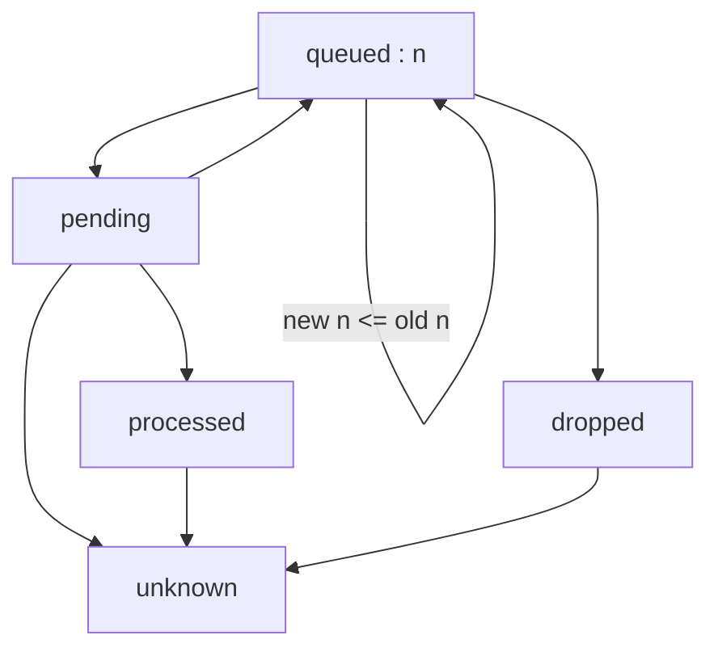
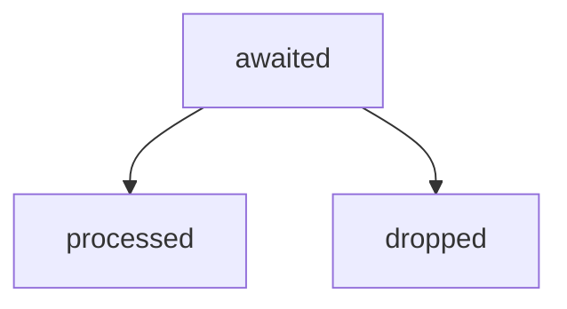
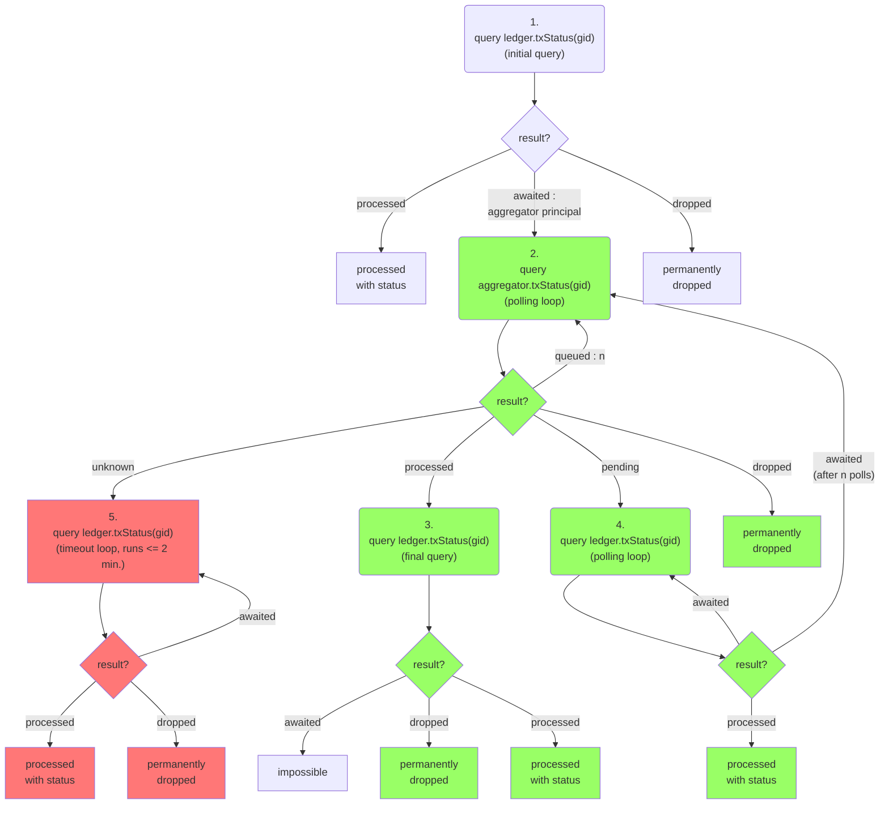
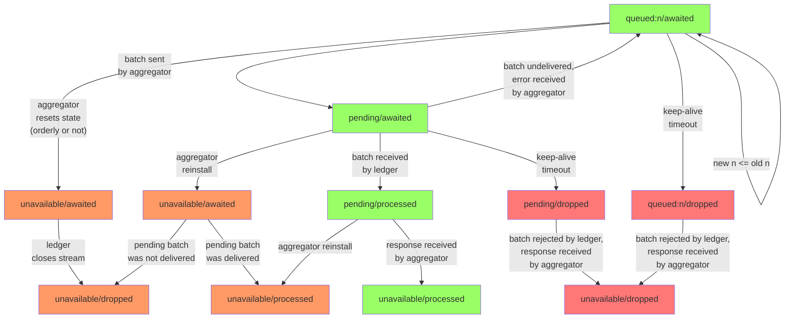
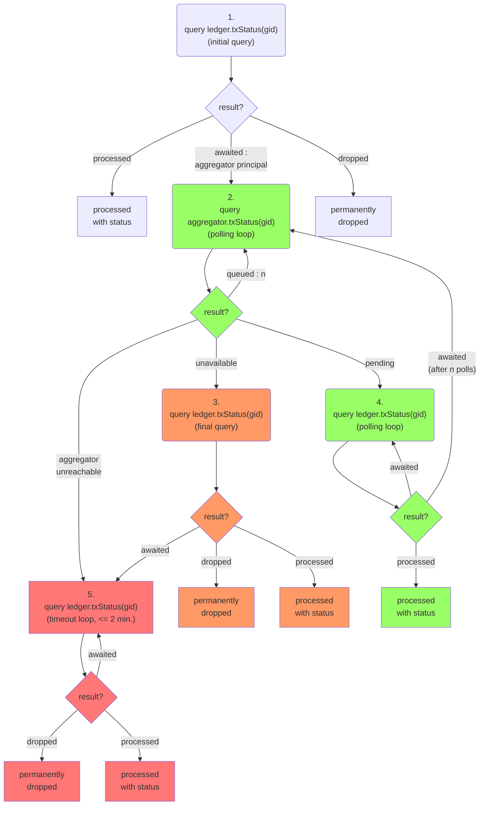

# hpl - The high-performance ledger

## Account model

### A multi-token ledger

### Principals and subaccounts

### Virtual accounts

## Use by external users

The high-performance ledger (hpl) is a set of canisters spread over various subnets.
We describe here how external users interact with this set of canisters collectively called the "hpl system" or simply the "hpl".
By external users we mean all those who communicate with the IC via ingress messages such as wallet frontends, dfx, etc.
This is not how other canisters interact with the hpl. 

The hpl consists of the ledger canister ("ledger") and multiple aggregator canisters ("aggregators") 
on different subnets.
External users submit transactions to any of the aggregators, normally a randomly chosen one.
The transaction will not execute right away during the submission call.
Instead, the transaction will only get queued inside the aggregator.
It will later be forwarded to the ledger in a batch together with other transactions
and will only then get executed in the ledger.
Forwarding to the ledger happens at regular intervals triggered by the heartbeat.

During submission the transaction undergoes only superficial checks.
It is not enough to say whether the transaction will succeed or not.
If the superficial checks pass then the aggregator returns a transaction id called "global id" (short "gid").
The user uses the gid to track the status and final result of the transaction via query calls.
Depending on the progress made, the user has to query the aggregator or the ledger, 
and sometimes both.

We will explain the possible status states of a transaction in detail now.
We will also provide a protocol that reliably determines the status of a transaction
in the face of race conditions and other edge cases such as canister restarts.

### Aggregator gid status states

The status of a transaction as per its gid can be queried via the `gidStatus(gid)` query function.
It returns one of the following states:

|State|Description|
|---|---|
|`queued:n`|The transaction is in the queue and the distance to the queue head is `n`.|
|`pending`|The transaction has been forwarded to the ledger but the aggregator does not know if the batch has been delivered. If the batch cannot be delivered then it will be retried.|
|`processed`|The transaction has been processed at the ledger.|
|`dropped`|The transaction is not in flight to the ledger and will not be retried.|
|`unknown`|The gid was issued by a different aggregator (incl. this aggregator before the last restart). Hence the aggregator does not know.|
|trap|The gid is not valid, i.e. can not have been issued by any aggregator|

The state transitions from `queued` to `pending` when the transaction is placed in a batch.

The state transitions from `pending` to `queued` when the aggregator receives a response telling it that the batch containing the transaction could no be delivered.

The state transitions from `pending` back to `processed` when the aggregator receives a response telling it that the batch has been processed by the ledger.

The state transitions from `queued` to `dropped` when the aggregator wants to reset the communication with the ledger. 
On a technical level, this means that the aggregator shuts down its current so-called "stream id" and needs to receive a new "stream id" from the ledger.
For example, this happens when the aggregator goes into stopping mode before an upgrade.
The ledger can also ask the aggregator to use a new stream id.

TODO: Can the state transition from `pending` directly to `dropped`? If the ledger ask the aggregator to use a new stream id and biggy-backs information about last processed position onto it.

The state transitions from `processed` to `unknown` when the aggregator restarts and wipes its state (e.g. upgrades).

*Note*: The protocol is designed such that the aggregator does not have to persist states across upgrades.

The state transitions from `dropped` to `unknown` when re-start communication after a communication reset.

The state transitions from `pending` directly to `unknown` only in exceptional cases.
For example, it can happen if the aggregator canister is deleted without first stopping it and is then re-installed.
This can cause outstanding call contexts to get dropped which in turn can transition a state from `pending` to `unknown`.

### Leder gid status states

The status of a transaction as per its gid can be queried via the `gidStatus(gid)` query function.
It returns one of the following states:

|State|Description|
|---|---|
|`awaited`|The transaction has not yet been received from the aggregator but can still come.|
|`processed`|The transaction has been processed.|
|`dropped`|The transaction has not been processed and cannot be processed anymore.|
|trap|The gid can not have been issued by any aggregator.|

For valid gids the transition diagram is:

### Frontend flow diagram to track transaction status

Notes:
* The diagram starts at the top with a query to the ledger. This is necessary if we do not know anything about the gid. If we already know the principal of the aggregator from which it was obtained then we can go directly to step 2 where the green path starts.
* The red path only happens if the aggregator has gone through an upgrade and lost its state.
* A "dropped" result should be confirmed by a query in update mode or by a certified variable. Only after that is it safe to resubmit the same transaction.
* If in step 2 the aggregator is unreachable (stopped, frozen, deleted) then we proceed as in step 5. However, if the loop does not terminate within 2 minutes then the aggregator may have come back up with its state intact and resumed operation. Hence we go back to step 2 if that happens. 

## TODO

Review ways to confirm a dropped state by a query in update mode or by a certified variable.

Review ways in which the aggregator can be unreachable. And in which ways it can recover from there with intact state.

   Transactions can be permanently dropped due to the following reasons:
   * The aggregator was frozen (due to low cycle balance) and remained frozen
   for a certain time (~2 minutes) while the transaction was queued.
   * The aggregator ran out of cycles entirely (hence got uninstalled) while
   the transaction was queued.
   * The communication from the aggregator's subnet to the ledger's subnet was
   interrupted for longer than a certain time (~2 minutes).
   * The aggregator was upgraded while the transaction was queued and the
   upgrade took longer than a certain time (~2 minutes).
   * The aggregator was upgraded while the transaction was queued and
   discarded its state.

## processBatch

* Ledger rejects if there is gap in then stream (as if message was not delivered). This is done because the aggregator handles it just like if the message was not delivered, in a unified way.
* Ledger accepts the message and responds with an error if the stream is closed. This is done because the aggregator has to programmatically handle this response.

## Aggregator/Ledger combined gid status state transitions

This is only for valid gids, i.e. gids that have actually been obtained from an aggregator.
We ignore the `null` status at the ledger because it can only happen with a frontend bug.

The orange and red colors symbolize the paths that involve a reset in the communication between aggregator and ledger, i.e. a change of stream id.
Orange means the aggregator initiated the reset,
red means the ledger initiated the reset.

## Frontend status querying

If the transaction is older then the frontend would expect that the transactions has already been processed. In this case it starts with step 1.

If the transaction is fresh then it may not have been processed yet. If the frontend remembers the principal of the aggregator to which it was submitted then the frontend starts with step 2, otherwise with step 1.

Under normal circumstances the green flow happens.

If the frontend polls slowly it may miss the `pending` state. This causes it to switch over to the orange flow.

The red path happens if the aggregator has gone through an upgrade and lost its state.
The aggregator might be unreachable for the frontend (e.g. down for upgrade, frozen, deleted) 
or it might already be back up but with its former state deleted.

