# hpl - The high-performance ledger

## Account model

### Tokens

The ledger is a multi-token ledger.
It currently supports only fungible tokens.
A fungible token is identified by its asset id (type `nat`).
Token quantities are represented as `nat`s that must fit in 128 bits.

### Principals and subaccounts

Accounts are owned by principals. 
A principal can have an arbitrary number of accounts.
The accounts of a principal are numbered consecutively `0, 1, 2, ...`.
Hence, an account reference is a pair `(principal, subid)` where `subid` is a `nat`.

Each account has a *unit* which specifies the asset id that it can hold. 
The unit is permanent, i.e. cannot change.

Accounts have to be explicitly opened by the owner.
When opening a new account the owner specifies the unit. 
An owner can have multiple accounts for the same unit.

Transfers from or to accounts fail if the transferred asset id does not match the account unit.

### Virtual accounts (part 1)

Unlike in most other ledgers, it is not possible for one account owner A to deposit
tokens into any account of another owner B (even if the asset id matches the account unit).
Instead, B has to first grant access to the sender A on a per-account basis. 
This happens by opening so-called virtual accounts.
Without virtual accounts the only transfers possible would be for one owner to transfer between his own accounts.

A virtual account V of an owner A specifies:
* a *backing account* X which is an account of A in the sense above (a "physical" account)
* an *access principal* B.
The only principal that can access V in a transfer, 
either as sending or receiving account,
is B.
Even A cannot access V in a transfer.
When a transfer is executed then any balance change affecting V is applied to X.

The access principal of a virtual account is permanent, i.e. cannot be changed.

A virtual account has a unit which is inherited from its backing account.
The backing account of a virtual account can be changed to a different one of the same unit.

Virtual accounts are referenced by their owner and a virtual account id which is a `nat`.
The virtual account ids are consecutive numbers `0, 1, 2, ...`.
Virtual accounts need to be openend explicitly by their owner.

A virtual account can be viewed as a "gated port" to a physical account.
It has a port id (the virtual account id) and is gated by the access principal.

Transfers created by a principal A can:
* send from a physical account of A to another physical account of A
* send from a physical account of A to a virtual account of any principal with access principal A
* send from a virtual account of any principal with access principal A to a physical account of A
* send from a virtual account of any principal with access principal A to another virtual account of any other principal with access principal A

### Virtual accounts (part 2)

Virtual accounts also have balances.
The balance of a virtual account V is independent of the balance in the backing subaccount X.
It can be lower or higher.
V's balance can be freely set or adjusted up and down by the owner.

When a transfer is executed involving V then the transfer's balance change is applied to V's balance *and* to X's balance.
If the balance change is negative (i.e. the transfer is outgoing)
then there must be sufficient balance in V *and* in X or the tranfer will fail.

For incoming transfers V's balance can be used to track the cumulative deposits made by the access principal B.

For outgoing transfers V's balance can be used as an allowance to B because B can withdraw only up to V's balance even if X's balance is higher.

Thus virtual accounts as a concept have similarities with allowance and approve-transfer methods. 

### Transfers

A transfer is described by the following data:

|Field|Description|
|---|---|
|caller|The principal who submits the transfer.|
|from|The account reference of the sending account. A physical account of caller of a virtual account with access principal A.|
|to|The account reference of the receiving account. A physical account of caller of a virtual account with access principal A.|
|asset id|The unit to transfer.|
|amount|The quantity to transfer or the directive "max".|
|memo|An array of blobs.|

The amount directive "max" transfers the entire balance of the sending account at the time of execution of the transfer.

The memo can hold arbitrary meta data and is irrelevant for the execution of the transfer. 

## Transaction API for external users

The high-performance ledger (hpl) is a set of canisters spread over various subnets.
We describe here how external users interact with this set of canisters collectively called the "hpl system" or simply the "hpl".
By external users we mean all clients who communicate with the IC via ingress messages such as wallet frontends, dfx, etc.
This is not how other canisters interact with the hpl. 

The hpl consists of the ledger canister ("ledger") and multiple aggregator canisters ("aggregators") 
on different subnets.
External users submit transactions to any of the aggregators, normally a randomly chosen one.
The transaction will not execute right away during the submission call.
Instead, the transaction will only get queued inside the aggregator.
It will later be forwarded to the ledger in a batch together with other transactions
and will only then get executed in the ledger.
Forwarding to the ledger happens at regular intervals triggered by the heartbeat.

During submission the transaction undergoes only superficial checks.
It is not enough to say whether the transaction will succeed or not.
If the superficial checks pass then the aggregator returns a transaction id called "global id" (short "gid").
The user uses the gid to track the status and final result of the transaction via query calls.
Depending on the progress made, the user has to query the aggregator or the ledger, 
and sometimes both.

We will explain the possible status states of a transaction in detail now.
We will also provide a protocol that reliably determines the status of a transaction
in the face of race conditions and other edge cases such as canister restarts.

### Streams

Aggregator and ledger set up a communication channel called a _stream_.
Streams can be opened and closed (but not re-opened).
The ledger has authority over the state of the stream.
The following actions are possible:
* The aggregator requests from the ledger to open a new stream.
* The aggregator requests from the ledger to close the open stream.
* The ledger closes an open stream and notifies the aggregator.

At any point in time there it at most one stream open per aggregator.
The aggregator can have the following states:
* No stream (after first install or reinstall)
* A current stream which is open
* A current stream which is closed

Gids belongs to one and only one stream.
A gid can only have been issued when its stream was open (at the aggregator).
A gid cannot be forwarded anymore once its stream is closed (at the ledger).

### Leder gid status states

A gid at the ledger can have the following states:

* processed : has been received, all received transactions are immediately processed
* awaited : its stream is open has not been received yet  
* dropped : has not been received and its stream has been closed
* invalid : does not belong to a stream that has ever been opened

We say a gid is _settled_ if it is either processed or dropped. 

The status of a transaction as per its gid can be queried via the `txStatus(gid)` query function.
It returns one of the following states or traps:

|State|Description|
|---|---|
|`awaited`|The transaction has not yet been received from the aggregator but can still come.|
|`processed`|The transaction has been processed.|
|`dropped`|The transaction has not been processed and cannot be processed anymore.|
|`CANISTER_ERROR` (trap)|The gid does not belong to any previously opened stream.|

The status `processed` does not yet say anything about the result of the transaction.
The result is a different data point and can be `success` or `failure`.

Note:
The ledger returns `awaited` for gids that have not yet been issued by the aggregator and that may or may not be issued in the future.

#### Transition diagram

|Transition|Description|
|---|---|
|`awaited` -> `processed`|The transaction is received in a batch and processed.|
 `awaited` -> `dropped`|The gids stream is being closed.|
 
The ledger will close a stream after a period of inactivity, i.e. if no batches were received for that stream for a certain time.
This indicates an interruption in the communication between aggregator and ledger.

Closing streams after inactivity is done to enhance the user experience.
For, if a transaction is known to be dropped, then the client can safely resubmit it to the same aggregator or to a different aggregator.
Without this mechanism the client would never be able to safely resubmit and would have to wait indefinitely, not knowing when the communication between the two canisters resumes.

### Aggregator gid status states

The status of a transaction as per its gid can be queried via the `txStatus(gid)` query function.
It returns one of the following states or traps:

|State|Description|
|---|---|
|`queued:n`|The gid is in the queue and the distance to the queue head is `n`.|
|`pending`|The gid has been forwarded to the ledger but the aggregator does not know if the batch has been delivered. If the batch cannot be delivered then it will be retried.|
|`other`|The gid has either been settled or was issued by a different aggregator.|
|`CANISTER_REJECT` (throw)|The aggregator does not have a current stream (after first install or reinstall).|
|`CANISTER_ERROR` (trap)|The gid belongs to the current stream but has not yet been issued.|

#### Standard transitions

|Transition|Description|
|---|---|
|`queued:n` -> `queued:n'`|A prior batch is sent and the transaction moves closer to the head of the queue.|
|`queued` -> `pending`|The transaction is placed in a batch.|
|`pending` -> `queued`|The aggregator receives a response telling it that the batch containing the transaction will not be processed. The transactions is queued again and will be retried.|
|`pending` -> `other`|- The aggregator receives a response telling it that the batch has been processed by the ledger, or - the aggregator receives a response telling it that the ledger has closed the current stream.|
|`queued` -> `other`|The aggregator receives a response telling it that the ledger has closed the current stream.|

#### Exceptional transitions

|Transition|Description|
|---|---|
|any -> `CANISTER_REJECT`|Reinstall|
|`CANISTER_REJECT` -> `other`|New stream is opened.|

Note: The second transition means that all _old_ gids return `other` after a new stream is opened. 

### Client flow to track transaction status

Suppose the client (frontend) has submitted a transaction to an aggregator and received a gid.
Now it wants to track the transaction status and report progress to the user.
This continues until the ledger returns a status of `processed` or `dropped`.
When that happens the ledger will also returns the transaction result (success or failure).

#### Protocol 1

The client polls the aggregator while the status is either queued or pending.
While the status is queued the polling interval can be adjusted based on the distance n from the head of the queue.
The further away the slower we need to poll.
When the polling stops then the status is `other`.
Now the client does a single query to the ledger and receives either `processed` or `dropped`.
In case of `processed` the ledger also returns the transaction result (success or failure).

Note: If we have received `other` once for a gid from the aggregator that issued it then afterwards
the ledger cannot return `awaited`.

Proof: The state `other` can be reached only from `pending` or from `CANISTER_REJECT`.
The transition `pending -> other` only happens if the transaction's batch was was processed,
in which case the ledger returns `processed`.
The transition `CANISTER_REJECT -> other` only happens if a new stream was opened,
which means the old stream must have been closed,
which means the gid is settled.

#### Protocol 2

Protocol 1 is the simplest one.
It is also characterized by only querying the ledger once.
It does not poll the ledger.
Instead, it waits until the information provided by the aggregator is sufficient to deduce that 
the transaction is no longer awaited at the ledger.
This approach creates latency that can be avoided
if we include polling the ledger.

For example, 
the client can poll the aggregator only while the gid is `queued`.
As soon as it is `pending` the client can start to poll the ledger
and continue to do so while the status is `awaited`.
When polling stops then the status is either `processed` or `dropped`.
This is quicker overall.

However, polling the ledger is unbounded and does not give the client sufficient status updates.
For example, delivery of a batch could fail and the status at the aggregator can go from pending back to queued.
Most clients will want to catch that, 
update it in the user frontend, 
and go back to polling the aggregator.
Therefore, it is advisable to time out polling the ledger 
and switch back to polling the aggregator at some point.

```mermaid
flowchart TD
    A("1.<br>query aggregator.txStatus(gid)<br>(polling loop)")

    %% Aggregator unbounded loop %%
    A --> R{result?}
    R -->|queued : n<br>CANISTER_REJECT| A 
    R -->|other| L
    R -->|pending| L2

    %% Ledger single query %%
    L("2.<br>ledger.txStatus(gid)<br>(single query)")
    L --> R2{result?}
    R2 --> |processed| PF2[processed<br>with result]
    R2 -->|dropped| D2["permanently<br>dropped"]
    R2 -->|awaited| X["cannot happen"]

    %% Ledger single query %%
    L2("3.<br>ledger.txStatus(gid)<br>(polling loop)")
    L2 --> R3{result?}
    R3 --> |processed| PF3[processed<br>with result]
    R3 --> |dropped| D3["permanently<br>dropped"]
    R3 --> |awaited| L2
    R3 --> |awaited<br> >N times| A
```

#### Combined protocol

Given protocol 2 we can also treat the single query as part of the polling loop and combine the two.
This means we enter the polling loop on `other` and on `pending`. 
But we know that if entered on `other` then it is guaranteed that the loop will return a result on the first query.

#### Variation

The discussion above assumed that the client knows the aggregator which has generated the gid.
If we do not know that then we have to start with one initial query to the ledger that will tell us the principal of the aggregator.

The box at the bottom right is the starting point of the protocols above.
