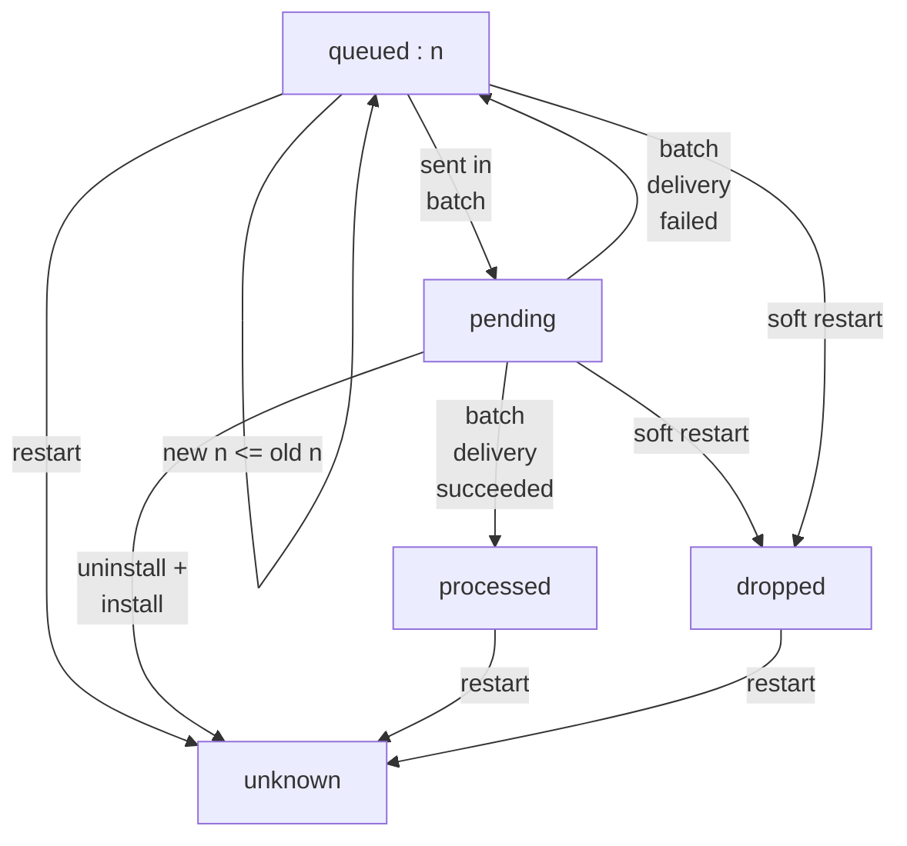
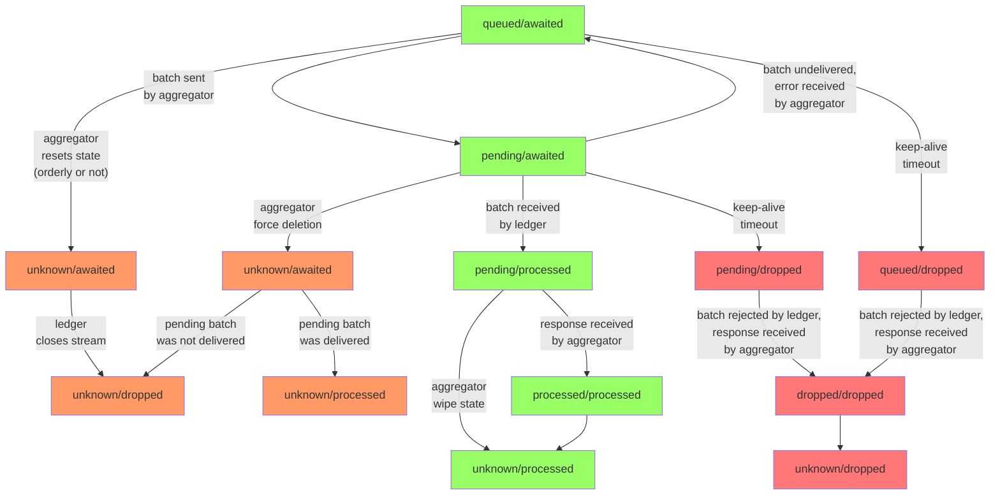

# hpl - The high-performance ledger

## Account model

### Tokens

The ledger is a multi-token ledger, i.e. "host" multiple different tokens.
It currently supports only fungible tokens.
A fungible token is identified by its asset id (type `nat`).
Token quantities are represented as `nat`s and must fit in 128 bits.

### Principals and subaccounts

Accounts are owned by principals. 
A principal can have an arbitrary number of accounts.
The accounts of a principal are numbered consecutively `0, 1, 2, ...`.
Hence, an account reference is a pair `(principal, subid)` where `subid` is a `nat`.

Each account has a *unit* which specifies the asset id that it can hold. 
The unit is permanent, i.e. cannot change.

Accounts have to be explicitly opened by the owner.
When opening a new account the owner specifies the unit. 
An owner can have multiple accounts for the same unit.

Transfers from or to accounts fail if the transferred asset id does not match the account unit.

### Virtual accounts (part 1)

Unlike in most other ledgers, it is not possible for one account owner A to deposit
tokens into any account of another owner B (even if the asset id matches the account unit).
Instead, B has to first grant access to the sender A on a per-account basis. 
This happens by opening so-called virtual accounts.
Without virtual accounts the only transfers possible would be for one owner to transfer between his own accounts.

A virtual account V of an owner A specifies:
* a *backing account* X which is an account of A in the sense above (a "physical" account)
* an *access principal* B.
The only principal that can access V in a transfer, 
either as sending or receiving account,
is B.
Even A cannot access V in a transfer.
When a transfer is executed then any balance change affecting V is applied to X.

The access principal of a virtual account is permanent, i.e. cannot be changed.

A virtual account has a unit which is inherited from its backing account.
The backing account of a virtual account can be changed to a different one of the same unit.

Virtual accounts are referenced by their owner and a virtual account id which is a `nat`.
The virtual account ids are consecutive numbers `0, 1, 2, ...`.
Virtual accounts need to be openend explicitly by their owner.

A virtual account can be viewed as a "gated port" to a physical account.
It has a port id (the virtual account id) and is gated by the access principal.

Transfers created by a principal A can:
* send from a physical account of A to another physical account of A
* send from a physical account of A to a virtual account of any principal with access principal A
* send from a virtual account of any principal with access principal A to a physical account of A
* send from a virtual account of any principal with access principal A to another virtual account of any other principal with access principal A

### Virtual accounts (part 2)

Virtual accounts also have balances.
The balance of a virtual account V is independent of the balance in the backing subaccount X.
It can be lower or higher.
V's balance can be freely set or adjusted up and down by the owner.

When a transfer is executed involving V then the transfer's balance change is applied to V's balance *and* to X's balance.
If the balance change is negative (i.e. the transfer is outgoing)
then there must be sufficient balance in V *and* in X or the tranfer will fail.

For incoming transfers V's balance can be used to track the cumulative deposits made by the access principal B.

For outgoing transfers V's balance can be used as an allowance to B because B can withdraw only up to V's balance even if X's balance is higher.

Thus virtual accounts as a concept have similarities with allowance and approve-transfer methods. 

## API for external users

The high-performance ledger (hpl) is a set of canisters spread over various subnets.
We describe here how external users interact with this set of canisters collectively called the "hpl system" or simply the "hpl".
By external users we mean all those who communicate with the IC via ingress messages such as wallet frontends, dfx, etc.
This is not how other canisters interact with the hpl. 

The hpl consists of the ledger canister ("ledger") and multiple aggregator canisters ("aggregators") 
on different subnets.
External users submit transactions to any of the aggregators, normally a randomly chosen one.
The transaction will not execute right away during the submission call.
Instead, the transaction will only get queued inside the aggregator.
It will later be forwarded to the ledger in a batch together with other transactions
and will only then get executed in the ledger.
Forwarding to the ledger happens at regular intervals triggered by the heartbeat.

During submission the transaction undergoes only superficial checks.
It is not enough to say whether the transaction will succeed or not.
If the superficial checks pass then the aggregator returns a transaction id called "global id" (short "gid").
The user uses the gid to track the status and final result of the transaction via query calls.
Depending on the progress made, the user has to query the aggregator or the ledger, 
and sometimes both.

We will explain the possible status states of a transaction in detail now.
We will also provide a protocol that reliably determines the status of a transaction
in the face of race conditions and other edge cases such as canister restarts.

### Aggregator gid status states

The status of a transaction as per its gid can be queried via the `gidStatus(gid)` query function.
It returns one of the following states or traps:

|State|Description|
|---|---|
|`queued:n`|The transaction is in the queue and the distance to the queue head is `n`.|
|`pending`|The transaction has been forwarded to the ledger but the aggregator does not know if the batch has been delivered. If the batch cannot be delivered then it will be retried.|
|`processed`|The transaction has been processed at the ledger.|
|`dropped`|The transaction has not been processed at the ledger, is not in flight to the ledger and will not be retried.|
|`unknown`|The gid was issued by a different aggregator or by this aggregator before an upgrade.|
|trap|The gid is not valid, i.e. can not have been issued by any aggregator|

#### Simple transition diagram

|Transition|Description|
|---|---|
|`queued` -> `pending`|The transaction is placed in a batch.|
|`pending` -> `queued`|The aggregator receives a response telling it that the batch containing the transaction could no be delivered. It is queued again and will be retried.|
|`pending` -> `processed`|The aggregator receives a response telling it that the batch has been processed by the ledger.|
|`processed` -> `unknown`|The aggregator wipes its state (upgrade).|
|`dropped` -> `unknown`|The aggregator wipes its state (upgrade).|
|`pending` -> `dropped`|The ledger requests a communication reset (timeout).|

### Leder gid status states

The status of a transaction as per its gid can be queried via the `gidStatus(gid)` query function.
It returns one of the following states or traps:

|State|Description|
|---|---|
|`awaited`|The transaction has not yet been received from the aggregator but can still come.|
|`processed`|The transaction has been processed.|
|`dropped`|The transaction has not been processed and cannot be processed anymore.|
|trap|The gid can not have been issued by any aggregator.|

The status `processed` does not yet say anything about the result of the transaction.
The result is a different data point. It can be `success` or `failure`.

#### Correspondence to aggregator states

If the aggregator returns `processed` or `dropped` then it has exactly the same meaning as if the ledger returned it.
The two canisters may just become aware of the states at different points in time.
That is why we use the same name for states even though they come from different canisters.

However, `awaited` and `pending` are not the same.
First, the ledger returns `awaited` for gids that are `queued` at the aggregator.
Second, the ledger returns `awaited` for gids that have not yet been issued by the aggregator and that may or may not be issued in the future.
That is why we do not use the name "pending" for a state at the ledger.

#### Transition diagram

|Transition|Description|
|---|---|
|`awaited` -> `processed`|The transaction is received in a batch and processed.|
 `awaited` -> `dropped`|The ledger is notified about the fact that the aggregator has upgraded. Or the ledger has experienced an timeout and will the aggregator to reset the communication stream.|

### Frontend flow diagram to track transaction status

Notes:
* The diagram starts at the top with a query to the ledger. This is necessary if we do not know anything about the gid. If we already know the principal of the aggregator from which it was obtained then we can go directly to step 2 where the green path starts.
* The red path only happens if the aggregator has gone through an upgrade and lost its state.

## Detailed discussion of edge cases (WIP, do not read)
#### Edge cases

*Note*: The protocol is designed such that the aggregator can go through any of the following edge cases:
|Case|Description|
|---|---|
|being uninstalled and installed again|This refers to `uninstall_code` plus `install_code`. The canister will not process outstanding responses, wipe its state, start fresh from an empty canister just like if first installed.|
|being reinstalled| This refers to `install_code mode=reinstall`. The canister will wait for outstanding responses, then wipe its start, start fresh from an empty canister just like if first installed.|
|being upgraded| This refers to `install_code mode=upgrade`. Persisting the state of the aggregator is not implemented. We make sure that the upgrade sequence wipes the state and starts fresh by declaring no stable variables. So any upgrade behaves like a reinstall.|
|being stopped and then started again|This will persist the state.|
|being frozen and then unfrozen again|This will persist the state.|

In the diagrams below the first three cases are labeled as "restart".

The last two cases, if they last longer, will be recognized by the ledger as a timeout.
The ledger will then request the aggregator to do a "soft restart"
which means that the aggregator will voluntarily drop its state and start fresh.
It eventually has the same effect as a code reinstall but there is a transition phase.
In the diagrams below the start of a soft restart is labeled as "soft restart" and the completion of a soft restart is labeled as "restart".

Question: Is reinstall not immediate? Is there a phase in which the canister is effectively stopped but can still be queried?

Question: Are upgrades not immediate? Is there a phase in which the canister is effectively stopped but can still be queried?
If yes then then we might be able to return dropped by the aggregator before the ledger knows about it.

#### Soft restart

On a technical level, this means that the aggregator shuts down its current so-called "stream id" and obtains a new "stream id" from the ledger.
This happens when ledger request the aggregator to do that after a keep-alive timeout.

#### Transition diagram

|Transition|Description|
|---|---|
|`queued` -> `pending`|The transaction is placed in a batch.|
|`pending` -> `queued`|The aggregator receives a response telling it that the batch containing the transaction could no be delivered.|
|`pending` -> `processed`|The aggregator receives a response telling it that the batch has been processed by the ledger.|
|`queued` -> `unknown`|The aggregator wipes its state (restart).|
|`processed` -> `unknown`|The aggregator wipes its state (restart).|
|`dropped` -> `unknown`|The aggregator wipes its state (restart).|
|`queued` -> `dropped`|The ledger requests a restart and the soft restart begins.|
|`pending` -> `unknown`|The aggregator is uninstalled and installed again. Since this forcibly discards outstanding responses we do not transition through the `processed` state.|
|`pending` -> `dropped`|The ledger requests a restart and the soft restart begins. The information given to the aggregator in the request will resolve all pending to transaction states to either processed or dropped.|

Note: The state "dropped" is not strictly needed for the functionality of frontends. The aggregator could return "unknown" instead and the frontends would continue working correctly.
Or the frontend could not implement any special handling of the "dropped" state and treat it the same as the "unknown" state.
But if used then the state "dropped" allows the frontend to enhance user experience in the case of a soft restart. 
The definite transaction state will be shown quicker to the user.
Without it there could be a 2-minute delay.

### Frontend flow diagram to track transaction status

Notes:
* The diagram starts at the top with a query to the ledger. This is necessary if we do not know anything about the gid. If we already know the principal of the aggregator from which it was obtained then we can go directly to step 2 where the green path starts.
* The red path only happens if the aggregator has gone through an upgrade and lost its state.
* A "dropped" result should be confirmed by a query in update mode or by a certified variable. Only after that is it safe to resubmit the same transaction.
* If in step 2 the aggregator is unreachable (stopped, frozen, deleted) then we proceed as in step 5. However, if the loop does not terminate within 2 minutes then the aggregator may have come back up with its state intact and resumed operation. Hence we go back to step 2 if that happens. 

## TODO

Review ways to confirm a dropped state by a query in update mode or by a certified variable.

Review ways in which the aggregator can be unreachable. And in which ways it can recover from there with intact state.

   Transactions can be permanently dropped due to the following reasons:
   * The aggregator was frozen (due to low cycle balance) and remained frozen
   for a certain time (~2 minutes) while the transaction was queued.
   * The aggregator ran out of cycles entirely (hence got uninstalled) while
   the transaction was queued.
   * The communication from the aggregator's subnet to the ledger's subnet was
   interrupted for longer than a certain time (~2 minutes).
   * The aggregator was upgraded while the transaction was queued and the
   upgrade took longer than a certain time (~2 minutes).
   * The aggregator was upgraded while the transaction was queued and
   discarded its state.

## processBatch

* Ledger rejects if there is gap in then stream (as if message was not delivered). This is done because the aggregator handles it just like if the message was not delivered, in a unified way.
* Ledger accepts the message and responds with an error if the stream is closed. This is done because the aggregator has to programmatically handle this response.

## Aggregator/Ledger combined gid status state transitions

This is only for valid gids, i.e. gids that have actually been obtained from an aggregator.
We ignore the `null` status at the ledger because it can only happen with a frontend bug.

The orange and red colors symbolize the paths that involve a reset in the communication between aggregator and ledger, i.e. a change of stream id.
Orange means the aggregator initiated the reset,
red means the ledger initiated the reset.

## Frontend status querying

If the transaction is older then the frontend would expect that the transactions has already been processed. In this case it starts with step 1.

If the transaction is fresh then it may not have been processed yet. If the frontend remembers the principal of the aggregator to which it was submitted then the frontend starts with step 2, otherwise with step 1.

Under normal circumstances the green flow happens.

If the frontend polls slowly it may miss the `pending` state. This causes it to switch over to the orange flow.

The red path happens if the aggregator has gone through an upgrade and lost its state.
The aggregator might be unreachable for the frontend (e.g. down for upgrade, frozen, deleted) 
or it might already be back up but with its former state deleted.

