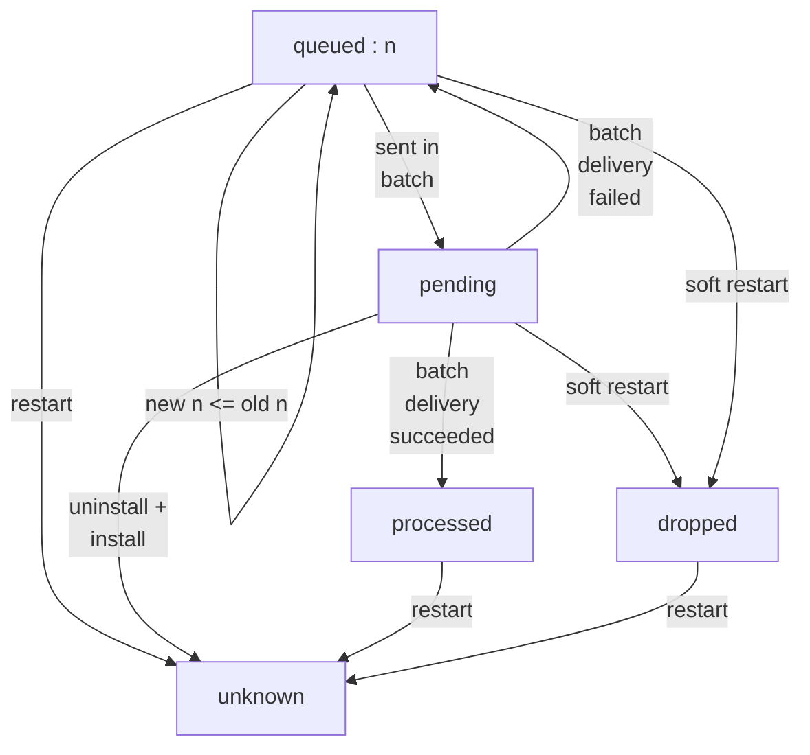
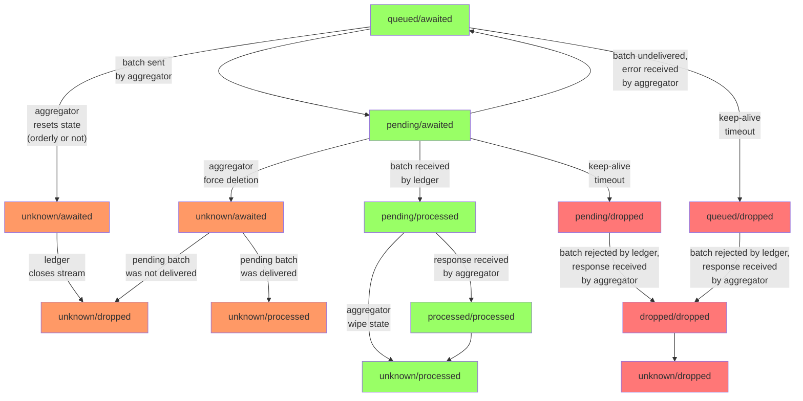
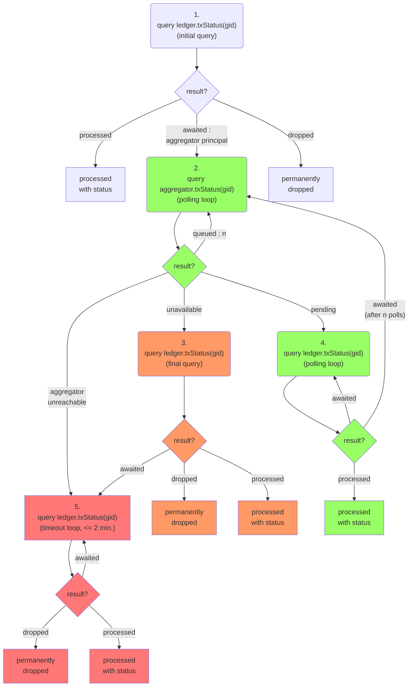

## Detailed discussion of edge cases (WIP, do not read)
#### Edge cases

*Note*: The protocol is designed such that the aggregator can go through any of the following edge cases:
|Case|Description|
|---|---|
|being uninstalled and installed again|This refers to `uninstall_code` plus `install_code`. The canister will not process outstanding responses, wipe its state, start fresh from an empty canister just like if first installed.|
|being reinstalled| This refers to `install_code mode=reinstall`. The canister will wait for outstanding responses, then wipe its start, start fresh from an empty canister just like if first installed.|
|being upgraded| This refers to `install_code mode=upgrade`. Persisting the state of the aggregator is not implemented. We make sure that the upgrade sequence wipes the state and starts fresh by declaring no stable variables. So any upgrade behaves like a reinstall.|
|being stopped and then started again|This will persist the state.|
|being frozen and then unfrozen again|This will persist the state.|

In the diagrams below the first three cases are labeled as "restart".

The last two cases, if they last longer, will be recognized by the ledger as a timeout.
The ledger will then request the aggregator to do a "soft restart"
which means that the aggregator will voluntarily drop its state and start fresh.
It eventually has the same effect as a code reinstall but there is a transition phase.
In the diagrams below the start of a soft restart is labeled as "soft restart" and the completion of a soft restart is labeled as "restart".

Question: Is reinstall not immediate? Is there a phase in which the canister is effectively stopped but can still be queried?

Question: Are upgrades not immediate? Is there a phase in which the canister is effectively stopped but can still be queried?
If yes then then we might be able to return dropped by the aggregator before the ledger knows about it.

#### Soft restart

On a technical level, this means that the aggregator shuts down its current so-called "stream id" and obtains a new "stream id" from the ledger.
This happens when ledger request the aggregator to do that after a keep-alive timeout.

#### Transition diagram

|Transition|Description|
|---|---|
|`queued` -> `pending`|The transaction is placed in a batch.|
|`pending` -> `queued`|The aggregator receives a response telling it that the batch containing the transaction could no be delivered.|
|`pending` -> `processed`|The aggregator receives a response telling it that the batch has been processed by the ledger.|
|`queued` -> `unknown`|The aggregator wipes its state (restart).|
|`processed` -> `unknown`|The aggregator wipes its state (restart).|
|`dropped` -> `unknown`|The aggregator wipes its state (restart).|
|`queued` -> `dropped`|The ledger requests a restart and the soft restart begins.|
|`pending` -> `unknown`|The aggregator is uninstalled and installed again. Since this forcibly discards outstanding responses we do not transition through the `processed` state.|
|`pending` -> `dropped`|The ledger requests a restart and the soft restart begins. The information given to the aggregator in the request will resolve all pending to transaction states to either processed or dropped.|

Note: The state "dropped" is not strictly needed for the functionality of frontends. The aggregator could return "unknown" instead and the frontends would continue working correctly.
Or the frontend could not implement any special handling of the "dropped" state and treat it the same as the "unknown" state.
But if used then the state "dropped" allows the frontend to enhance user experience in the case of a soft restart. 
The definite transaction state will be shown quicker to the user.
Without it there could be a 2-minute delay.

### Frontend flow diagram to track transaction status

Notes:
* A "dropped" result should be confirmed by a query in update mode or by a certified variable. Only after that is it safe to resubmit the same transaction.
* If in step 2 the aggregator is unreachable (stopped, frozen, deleted) then we proceed as in step 5. However, if the loop does not terminate within 2 minutes then the aggregator may have come back up with its state intact and resumed operation. Hence we go back to step 2 if that happens. 

## TODO

Review ways to confirm a dropped state by a query in update mode or by a certified variable.

Review ways in which the aggregator can be unreachable. And in which ways it can recover from there with intact state.

   Transactions can be permanently dropped due to the following reasons:
   * The aggregator was frozen (due to low cycle balance) and remained frozen
   for a certain time (~2 minutes) while the transaction was queued.
   * The aggregator ran out of cycles entirely (hence got uninstalled) while
   the transaction was queued.
   * The communication from the aggregator's subnet to the ledger's subnet was
   interrupted for longer than a certain time (~2 minutes).
   * The aggregator was upgraded while the transaction was queued and the
   upgrade took longer than a certain time (~2 minutes).
   * The aggregator was upgraded while the transaction was queued and
   discarded its state.

## processBatch

* Ledger rejects if there is gap in then stream (as if message was not delivered). This is done because the aggregator handles it just like if the message was not delivered, in a unified way.
* Ledger accepts the message and responds with an error if the stream is closed. This is done because the aggregator has to programmatically handle this response.

## Aggregator/Ledger combined gid status state transitions

This is only for valid gids, i.e. gids that have actually been obtained from an aggregator.
We ignore the `null` status at the ledger because it can only happen with a frontend bug.

The orange and red colors symbolize the paths that involve a reset in the communication between aggregator and ledger, i.e. a change of stream id.
Orange means the aggregator initiated the reset,
red means the ledger initiated the reset.

## Frontend status querying

If the transaction is older then the frontend would expect that the transactions has already been processed. In this case it starts with step 1.

If the transaction is fresh then it may not have been processed yet. If the frontend remembers the principal of the aggregator to which it was submitted then the frontend starts with step 2, otherwise with step 1.

Under normal circumstances the green flow happens.

If the frontend polls slowly it may miss the `pending` state. This causes it to switch over to the orange flow.

The red path happens if the aggregator has gone through an upgrade and lost its state.
The aggregator might be unreachable for the frontend (e.g. down for upgrade, frozen, deleted) 
or it might already be back up but with its former state deleted.

