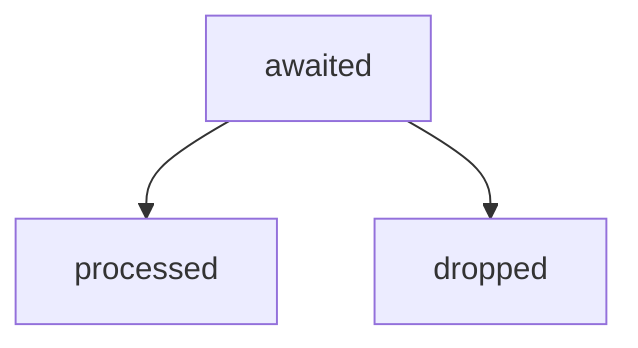
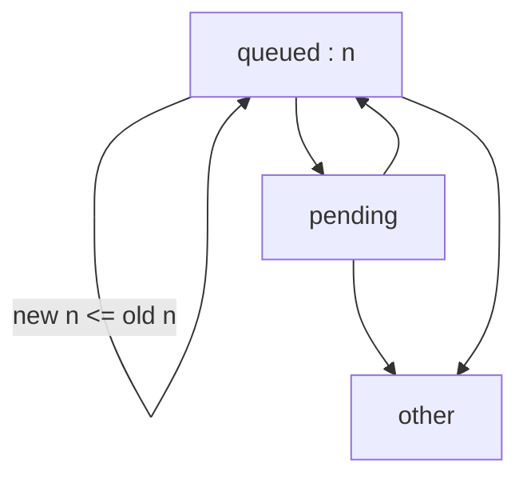
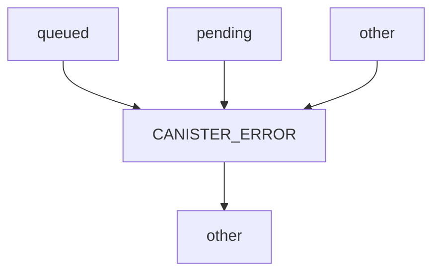
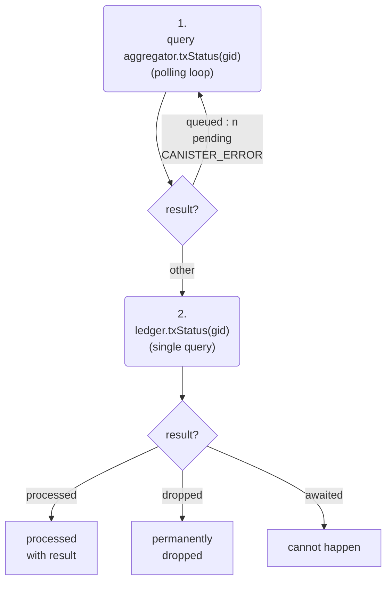
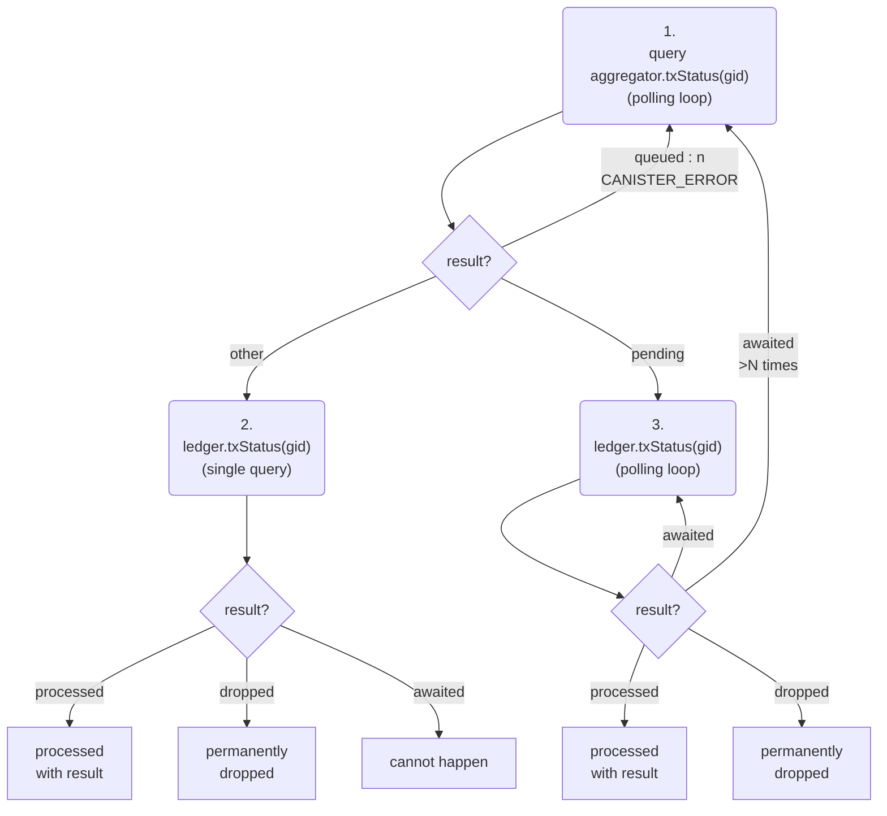
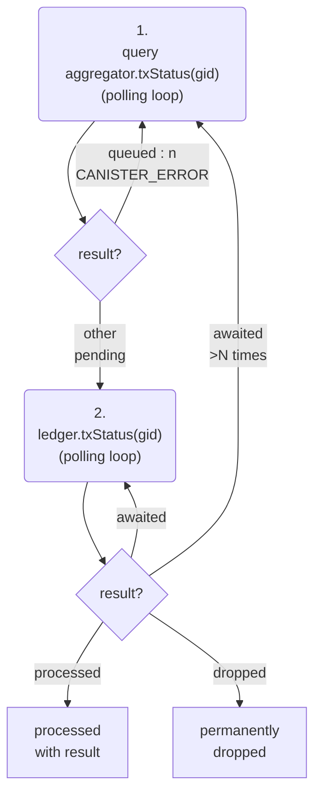

## Transaction API for external users

The high-performance ledger (hpl) is a set of canisters spread over various subnets.
We describe here how external users interact with this set of canisters collectively called the _hpl system_ or simply the _hpl_.
By external users we mean all clients who communicate with the IC via ingress messages such as wallet frontends, dfx, etc.
This is not how other canisters interact with the hpl. 

The hpl consists of the ledger canister ("ledger") and multiple aggregator canisters ("aggregators") 
on different subnets.
External users submit transactions to any of the aggregators, normally a randomly chosen one.
The transaction will not execute right away during the submission call.
Instead, the transaction will only get queued inside the aggregator.
It will later be forwarded to the ledger in a batch together with other transactions
and will only then get executed in the ledger.
Forwarding to the ledger happens at regular intervals triggered by the aggregator's heartbeat.

During submission the transaction undergoes only superficial checks.
They are not enough to determine whether the transaction will succeed or not.
If the superficial checks pass then the aggregator returns a transaction id called *global id* (short *gid*).
The user uses the gid to track the status and final result of the transaction via query calls.
Depending on the progress made, the user has to query the aggregator or the ledger, 
and sometimes both.

We will explain the possible status states of a transaction in detail now.
We will also provide a protocol that reliably determines the status of a transaction
in the face of race conditions and other edge cases such as canister restarts.

### Error handling

The philosophy of error handling in all canisters is as follows.

A trap (CANISTER_ERROR) means that there is an error on the receiver side of
the call. For example, the receiver can be stopping, stopped, running but
uninitialized, or there could be a bug in the receiver. Traps are considered
temporary errors and the caller can retry the call later. For example,
stopping/stopped are assumed to be transitional states of an upgrade cycle
and are therefore temporary. Bugs in the receiver code are assumed to get
fixed eventually through an upgrade and are therefore temporary as well.

A throw (CANISTER_REJECT) means that there is an error on the sender side of
the call. For example, the sender has passed invalid arguments or was not
authorized to make the call. This is a bug on the sender side because the
sender should have never made the call with the given arguments. Therefore
the sender is not expected to handle the response programmatically.

In all other cases, i.e. if an error is expected to occur in normal operation
and if the caller is expected to handle it programmatically, then an "graceful"
error is returned. This can be a null value in an option type or a dedicated
error case in a variant. A typical case is calls that can fail because of race
conditions. For example, an attempt to access an account that has been deleted
by a concurrent process. Those case occur naturally in normal operation and the
caller is expected to handle them.

### Streams

Aggregator and ledger set up a communication channel called a _stream_.
Streams can be opened and closed (but not re-opened).
The ledger has authority over the state of the stream.
At any point in time there it at most one stream open per aggregator.
The following actions are possible:
* The aggregator requests from the ledger to open a new stream.
* The aggregator requests from the ledger to close the open stream.
* The ledger closes an open stream and notifies the aggregator.

The aggregator can have the following states:
* No stream (after first install or reinstall)
* A current stream which is open
* A current stream which is closed

A gid belongs to one and only one stream.
The stream that it belongs to can be identified because the gid contains a stream id.
A gid can only have been issued when its stream was open (at the aggregator).
A gid can only be accepted by the ledger when its stream is open (at the ledger).

### Leder gid status states

A gid at the ledger can have the following states:

* _processed_ : has been received (all received transactions are immediately processed)
* _awaited_ : has not been received yet but its stream is open 
* _dropped_ : has not been received and its stream has been closed
* _invalid_ : does not belong to a stream that has ever been opened

We say a gid is _settled_ if it is either processed or dropped. 

The status of a transaction as per its gid can be queried via the `txStatus(gid)` query function.
It returns one of the following states or throws:

|State|Description|
|---|---|
|`awaited`|The transaction has not yet been received from the aggregator but can still come.|
|`processed:result`|The transaction has been processed.|
|`dropped`|The transaction has not been processed and cannot be processed anymore.|
|`CANISTER_REJECT` (throw)|The gid does not belong to any previously opened stream.|

The status `processed` includes the result of the transaction which can be `success` or `failure`.
The `failure` case contains information about the error that errors.
The `success` case contains information about the execution result of the transactions.
For example, if it is was a `max` transfer then the `success` case contains the amount that was transferred.

The status `awaited` does not necessarily mean that the gid has actually been issued by the aggregator because the ledger does not know that information.
It may also mean that the aggregator can issue the gid in the future.

#### Transition diagram

This is the transition diagram for valid gids:

|Transition|Description|
|---|---|
|`awaited` -> `processed`|The transaction is received in a batch and processed.|
 `awaited` -> `dropped`|The gids stream is being closed.|
 
The ledger will close a stream after a period of inactivity, i.e. if no batches were received for that stream for a certain time.
This indicates an interruption in the communication between aggregator and ledger.

Closing streams after inactivity is done to enhance the user experience.
For, if a transaction is known to be dropped, then the client can safely resubmit it to the same aggregator or to a different aggregator.
Without this mechanism the client would never be able to safely resubmit and would have to wait indefinitely, not knowing when the communication between the two canisters resumes.

### Aggregator gid status states

The status of a transaction as per its gid can be queried via the `txStatus(gid)` query function.
It returns one of the following states or traps:

|State|Description|
|---|---|
|`queued:n`|The gid is in the queue and the distance to the queue head is `n`.|
|`pending`|The gid has been forwarded to the ledger but the aggregator does not know if the batch has been delivered. If the batch cannot be delivered then it will be retried.|
|`other:time`|The gid has either been settled or was issued by a different aggregator and the last timestamp received from the ledger is `time`.|
|`CANISTER_REJECT` (throw)|The gid belongs to the current stream but has not yet been issued.|
|`CANISTER_ERROR` (trap)|The aggregator does not have a current stream id.|

When the aggregator does not have a current stream id then it often also does not know whether the previous stream id was closed or not.
This happens for example after a fresh install before the aggregator has communicated with the ledger.
In this case, the only safe response is to trap because the aggregator cannot distinguish between pending and settled.

Note: By a _fresh install_ we mean the state after first installation or after an uninstall-reinstall cycle.
The state after a stop-upgrade cycle is not called a fresh install.
An aggregator can go through a stop-upgrade cycle and maintain its stream id. 

Note: The case `other` for practical purposes means `settled`. This is because in practice a client will query the correct aggregator, the one which has issued the gid. And in this case `other` is equivalent to `settled`.

Note: The ledger time is useful for clients who query the ledger after having received the `other:time` response. It is possible that the subsequent ledger query is routed to a node that has fallen behind and produces a query response from before the transaction was processed. Knowing the ledger time the client can determine whether the node was up-to-date or not.

#### Standard transitions

|Transition|Description|
|---|---|
|`queued:n` -> `queued:n'`|A prior batch is sent and the transaction moves closer to the head of the queue.|
|`queued` -> `pending`|The transaction is placed in a batch.|
|`pending` -> `queued`|The aggregator receives a response telling it that the batch containing the transaction will not be processed. The transactions is queued again and will be retried.|
|`pending` -> `other`|- The aggregator receives a response telling it that the batch has been processed by the ledger, or - the aggregator receives a response telling it that the ledger has closed the current stream.|
|`queued` -> `other`|The aggregator receives a response telling it that the ledger has closed the current stream.|

#### Exceptional transitions

|Transition|Description|
|---|---|
|any -> `CANISTER_ERROR`|Uninstall-reinstall cycle.|
|`CANISTER_ERROR` -> `other`|New stream is opened.|

Note: The second transition means that all old gids return `other` after a new stream is opened.
The reason is the behavior of the ledger. 
When the aggregator receives a new stream from the ledger then it knows that the ledger has closed all its old stream ids.

### Client flow to track transaction status

Suppose the client (frontend) has submitted a transaction to an aggregator and received a gid.
Now it wants to track the transaction status and report progress to the user.
This continues until the ledger returns a status of `processed` or `dropped`.
When that happens the ledger will also return the transaction result (success or failure).

#### Protocol 1

The client polls the aggregator while the status is either queued or pending.
While the status is queued the polling interval can be adjusted based on the distance n from the head of the queue.
The further away the slower we need to poll.
When the polling stops then the status is `other`.
Now the client does a single query to the ledger and receives either `processed:result` or `dropped`.

Note: If we have received `other` once for a gid from the aggregator that issued it then afterwards
the ledger cannot return `awaited`.

Proof: The state `other` can be reached only from `pending` or from `CANISTER_ERROR`.
The transition `pending -> other` only happens if the transaction's batch was was processed,
in which case the ledger returns `processed`.
The transition `CANISTER_ERROR -> other` only happens if a new stream was opened,
which means the old stream must have been closed,
which means the gid is settled.

#### Protocol 2

Protocol 1 is the simplest one.
It is also characterized by only querying the ledger once.
It does not poll the ledger.
Instead, it waits until the information provided by the aggregator is sufficient to deduce that 
the transaction is no longer awaited at the ledger.
This approach creates latency that can be avoided
if we include polling the ledger.

For example, 
the client can poll the aggregator only while the gid is `queued`.
As soon as it is `pending` the client can start to poll the ledger
and continue to do so while the status is `awaited`.
When polling stops then the status is either `processed` or `dropped`.
This is quicker overall.

However, polling the ledger is unbounded and does not give the client sufficient status updates.
For example, delivery of a batch could fail and the status at the aggregator can go from pending back to queued.
Most clients will want to catch that, 
update it in the user frontend, 
and go back to polling the aggregator.
Therefore, it is advisable to time out polling the ledger 
and switch back to polling the aggregator at some point.

#### Combined protocol

Given protocol 2 we can also treat the single query as part of the polling loop and combine the two.
This means we enter the polling loop on `other` and on `pending`. 
But we know that if entered on `other` then it is guaranteed that the loop will return a result on the first query.

